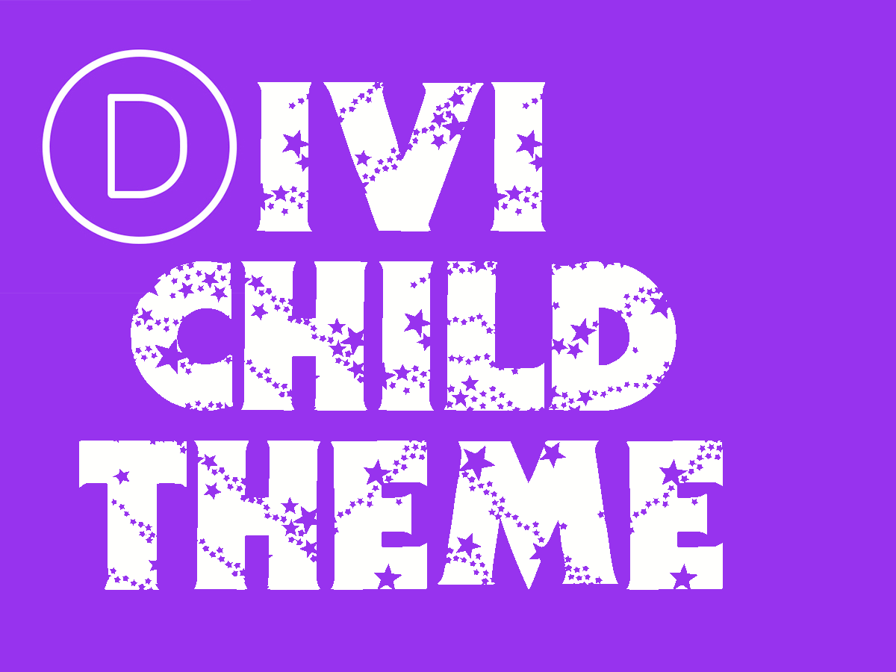

# Divi Child Theme

Browsers tend to cache CSS and JS files. Using this method we can be assured that our visitors will see changes made to child theme's CSS and JS files immediately. Also, it works with WordPress multisite/network setup.

Tested up to (November 2019):

- WordPress 5.3
- Divi 4.0

